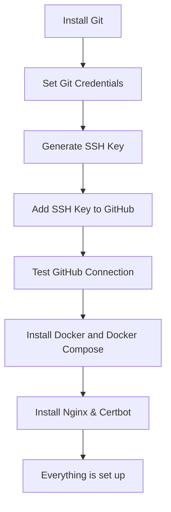

# This repository is in development phase
> [!WARNING]
> This repository is in development phase, I continue to research best practices for initializing the base VM environment.
<br />
<br />
<br />

## 0. The Requirements
1. Make sure your application's Dockerfile is properly configured and works as expected in production mode.
2. Create an ```infra-as-code``` repository and include a ```docker-compose.yml``` file to establish multi-container setup. 
<br />
<br />
<br />

## 1. Rent a VM
1. Rent a virtual machine or host your own server to proceed with next steps.
<br />
<br />

## 2. Connect By SSH

Install the following extensions: [Remote - SSH](https://marketplace.visualstudio.com/items?itemName=ms-vscode-remote.remote-ssh), [Remote - SSH: Editing Configuration Files](https://marketplace.visualstudio.com/items?itemName=ms-vscode-remote.remote-ssh-edit), [Remote Explorer](https://marketplace.visualstudio.com/items?itemName=ms-vscode.remote-explorer).

1. Configure the SSH extension to connect to the VM using it.
2. Connect to your VM by this extension.
<br />

> [!IMPORTANT]
> The connecting via Vs Code will take approximately 1 GB to install the ```.vscode``` folder and this process cannot be avoided.
<br />
<br />

## 3. Setup up a base environment for VM

Clone my own [bash script](https://github.com/kusainovv/vm-bootstrap/blob/main/deploy.sh) to be ready to implement the next steps on your VM.

---

### Here're the steps that this bash script performs.



## Get ready to install a base environment for your VM.

1. Create a ``` deploy.sh ``` file in root directory, copy my code and paste it in your file or just copy/paste your file.
2. In the same directory where your file open a Terminal and execute ```sh chmod +x deploy.sh ``` for making your script executable.
3. Run in Terminal ```sh ./deploy.sh ```.
4. Follow the instructions that u will see in Terminal.
5. Keep hacking.
<br />
<br />
<br />

## 4. Fork your repositories in VM.
Fork your private or public repository in VM and don't touch them.
<br />
<br />
<br />

## 5. Set a Github Action

In your repositories, u need to set up a ``` Publish Docker Container By GitHub Actions ``` github action, this action adds your build artifact in "Packages" tab and publish your image to ghcr.io.
<br />
<br />
<br />

## 6. Run a Github Action

When u trigger a Github Action u will see a build artifact in "Packages".


<br />
<br />
Look at right sidebar, click at build artifact in "Packages" tab.

<br />
<br />
<br />

## 7. Migrate from local registry to ghcr.io registry

<br />
<br />
<br />
So if you complete everything previous u need to copy the ```sh ghcr.io/kusainovv/vylo.frontend ``` line and instead of support a latest digest, let's add a ```sh :latest``` keyword.
<br />
<br />
After we upload images to ghcr.io, we can change a docker-compose.yml file:

```docker

version: "3.8"

services:
  frontend:
    image: "ghcr.io/kusainovv/vylo.frontend:latest"
    container_name: "rt-frontend"
    restart: always
    ports:
      - 3000:3000

```

At this moment, let's switch to domain and ssl certificates.
<br />
<br />
<br />
## 8. Domen
1. Buy a domen
2. Handshake a "A" DNS record and your ip
<br />
<br />
<br />

## 9. Nginx

In ```sh deploy.sh ``` we already install a nginx, so now we need to configure our server domain.

1. Go to ``` /etc/nginx/sites-available ```
2. Create a new file with the name is a your domain, e.g. google.com, wihout extensions.
3. Pase a code in your file

```
server {
    server_name google.com;

    location / {
        proxy_pass http://localhost:3000;  # Forward requests to an application running on port 3000
        proxy_set_header Host $host;
        proxy_set_header X-Real-IP $remote_addr;
        proxy_set_header X-Forwarded-For $proxy_add_x_forwarded_for;
        proxy_set_header X-Forwarded-Proto $scheme;
    }
}
```
4. Then, create a symbolic link in ``` sites-enabled ``` folder, run:

   ```sh sudo ln -s /etc/nginx/sites-available/google.com /etc/nginx/sites-enabled/ ```
5. ```sh sudo nginx -t ``` - Check a nginx status
6. ``` sudo systemctl reload nginx ``` - Reload a nginx

## 9. SSL

```sh sudo certbot --nginx```

1. Enter your email address.
2. Agree to the terms of service.
3. Select the domain you want to secure (Certbot automatically detects Nginx domains)
<br />
<br />
<br />
